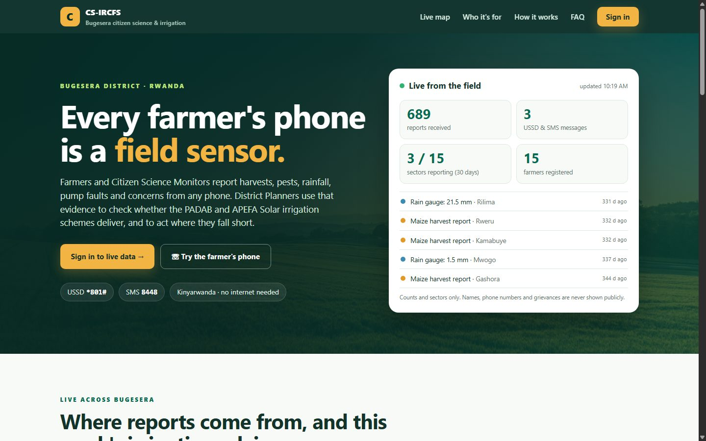
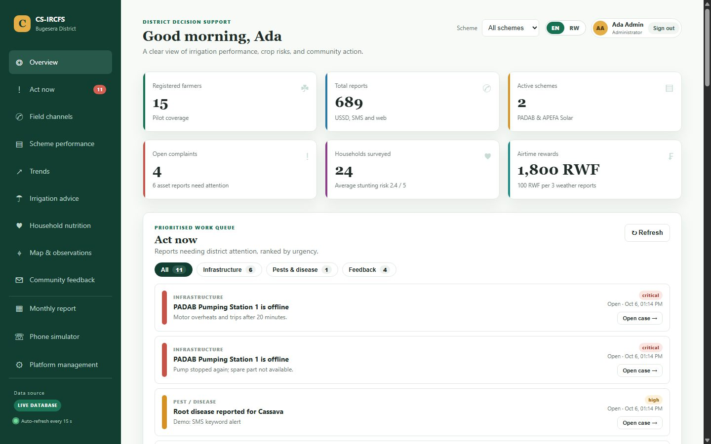
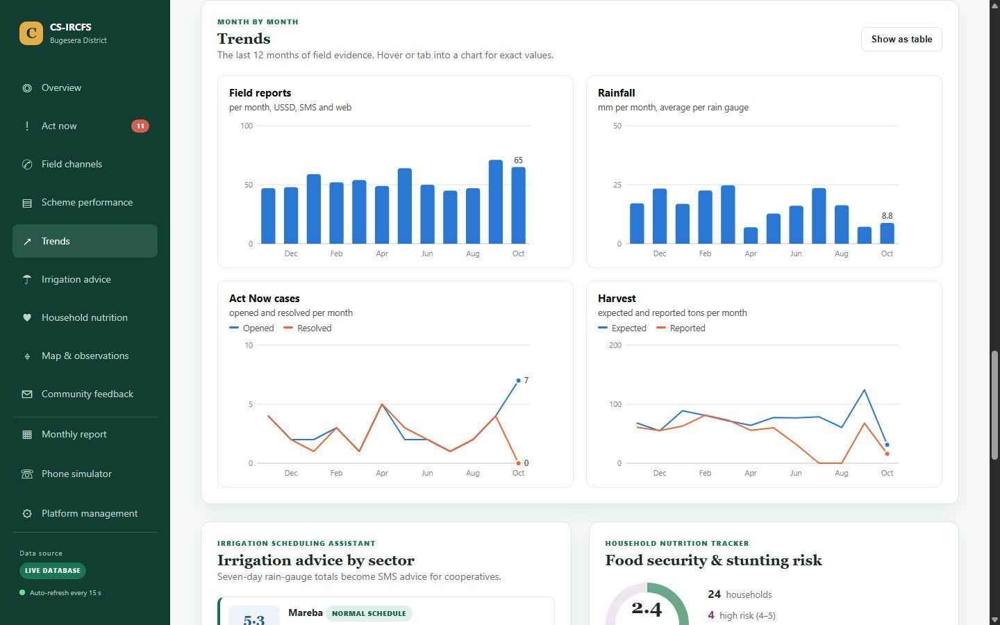
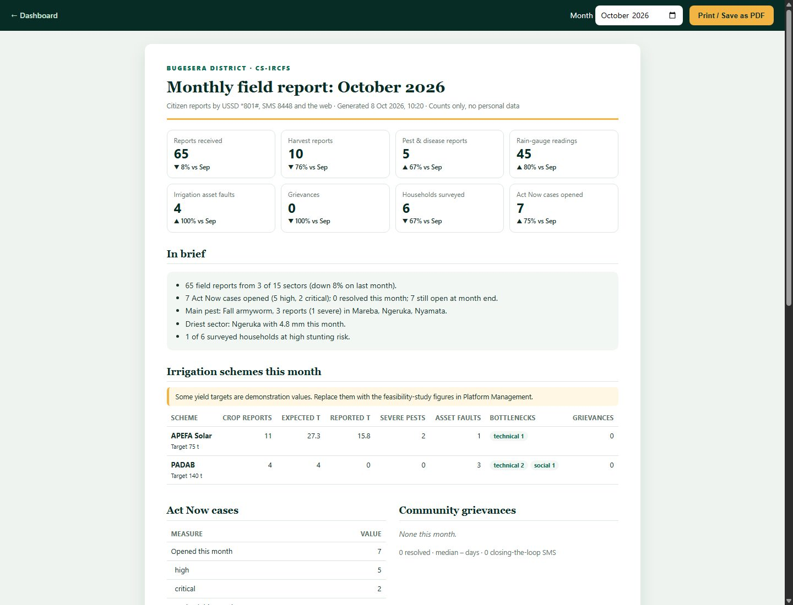

# CS-IRCFS

**Citizen Science for Irrigation Resilience and Climate-smart Food Security** — a field-reporting and decision-support platform for Bugesera District, Rwanda.

Farmers, Citizen Science Monitors and cooperatives report crop, water and community information from any mobile phone through **USSD `*801#`** and **SMS `8448`**, in Kinyarwanda and without internet access. District staff use that evidence to verify whether the **PADAB** and **APEFA Solar** irrigation schemes deliver their expected outcomes, to act on problems as they are reported, and to send advice back to the community.



## How it works

```text
Farmers · Citizen Science Monitors · Cooperatives      (any phone, no internet)
        │  USSD *801#  ·  SMS 8448   (Kinyarwanda first)
        ▼
Africa's Talking gateway  ──►  FastAPI  ──►  PostgreSQL / PostGIS
                                               │
        ┌──────────────────────────────────────┘
        ▼
District dashboard: outcome verification · Act Now cases · trends · monthly report
        │
        └──►  SMS back to citizens: irrigation advice · local tips · airtime · closing the loop
```

## Features

**Field reporting**
- Kinyarwanda USSD menu (six options, numeric choices, at most three levels) and SMS keywords (`IMVURA`, `NZANA`, `UMUSARURO`, `IKIBAZO`).
- First-time callers choose their sector and cell once, so every later report is mapped and linked to its irrigation scheme.
- Retried gateway deliveries are recognised and never recorded twice.

**Food security, irrigation and climate**
- Crowdsourced harvest reports compared with each scheme's verified yield target.
- Pest and disease alerts with a heat map; severe reports open an Act Now case automatically.
- Infrastructure health reporting by bottleneck type (technical, social, institutional, environmental), with recurring bottlenecks flagged per scheme.
- Citizen rain-gauge network and an irrigation scheduling assistant that combines 7-day gauge totals with the Open-Meteo rainfall forecast.
- Household nutrition survey with a stunting-risk score by cell.

**Accountability**
- Anonymous grievance log (the reporter is never stored, only the cell), including resettlement and downstream impacts.
- Case workflow with owners, deadlines and a full audit trail.
- Closing-the-loop SMS to every registered person in the affected cell when a problem is resolved.
- SMS alerts to district staff when a critical case opens.
- Airtime rewards for regular weather and infrastructure reporting.

**Analysis**
- District dashboard with live figures, Act Now queue, scheme performance, response health, irrigation advice, nutrition risk and a layered map.
- Twelve-month trend charts with a table view.
- Printable monthly district report, compared with the previous month.

**Access**
- Staff sign-in with roles: Citizen Science Monitors (read-only), district officers, District Planners and administrators.
- Area-level access: accounts can be limited to the sectors they work in.
- Public home page with live totals and sector activity; it never exposes names, phone numbers, message text or grievances.
- English and Kinyarwanda interface.

| | |
|---|---|
|  |  |
| District dashboard | Twelve-month trends |



*Screenshots show invented sample data.*

## Getting started

Requirements: Python 3.11 or later. PostgreSQL 16 with PostGIS for real use; SQLite works for evaluation.

```powershell
python -m pip install -r backend/requirements.txt
copy .env.example .env
.\start-local.ps1 -Demo
```

Open **http://127.0.0.1:8000**. The `-Demo` option runs on a separate SQLite database (`backend/demo.db`) filled with invented sample data, with sign-in turned off. It never touches the database configured in `.env`.

To run against PostgreSQL, set `DATABASE_URL` in `.env` and start without `-Demo`. Migrations are applied automatically:

```powershell
.\start-local.ps1
python backend/scripts/load_locations.py               # Bugesera's 15 sectors and 72 cells
python backend/scripts/create_admin.py you@example.org # first administrator
```

For Docker and hosted deployment, see [docs/deployment.md](docs/deployment.md).

| Address | Page |
| --- | --- |
| `/` | Public home page with live field activity |
| `/planner.html` | District dashboard |
| `/report.html` | Monthly district report |
| `/management.html` | Platform management: people, schemes, reports, accounts and areas |
| `/simulator.html` | On-screen feature phone for testing and training on `*801#` and `8448` |
| `/docs` | Interactive API reference |

## Configuration

All settings are environment variables, documented in [`.env.example`](.env.example). The main ones:

| Setting | Purpose |
| --- | --- |
| `DATABASE_URL` | PostgreSQL (production) or SQLite (evaluation) |
| `ENVIRONMENT`, `REQUIRE_API_KEY` | `production` with `REQUIRE_API_KEY=true` enforces sign-in |
| `SMS_PROVIDER`, `AIRTIME_PROVIDER`, `AFRICAS_TALKING_*` | Live delivery through Africa's Talking; `dry_run` records messages without sending |
| `ALERT_PHONE_NUMBERS`, `ALERT_MIN_PRIORITY` | Staff phones alerted by SMS when urgent cases open |
| `DRY_SPELL_THRESHOLD_MM`, `WET_SPELL_THRESHOLD_MM` | Irrigation advice thresholds (7-day rainfall) |
| `WEATHER_FORECAST_ENABLED` | Adds the Open-Meteo forecast to irrigation advice |
| `GOOGLE_CLIENT_ID` | Optional Google sign-in |

## Project structure

```text
cs-ircfs-platform/
├── backend/            FastAPI service
│   ├── app/              API routes, services, models and settings
│   ├── migrations/       Alembic database migrations
│   ├── scripts/          Location import, administrator setup, health checks
│   └── tests/            Automated tests (in-memory database)
├── dashboard/          Web interface served by the API
├── ussd-sms/           USSD menu map, SMS keywords and gateway setup
├── infrastructure/     Docker Compose stack (PostgreSQL/PostGIS + platform)
├── data/               Bugesera sector and cell boundaries (GeoPackage)
├── docs/               Documentation
├── scripts/            Repository utilities
├── Dockerfile · render.yaml · start-local.ps1 · .env.example
└── README.md
```

## Documentation

| Document | Contents |
| --- | --- |
| [User guide](docs/user-guide.md) | Pages, roles and areas, alerts, forecasts, scripts |
| [Architecture](docs/architecture.md) | How the system design is implemented; design document in [docs/architecture-design.docx](docs/architecture-design.docx) |
| [Data model](docs/data-model.md) | Tables, relationships and business rules |
| [Deployment](docs/deployment.md) | Local, Docker and hosted deployment; production checklist |
| [Field channels](ussd-sms/README.md) | USSD menu, SMS keywords, Africa's Talking setup |
| [Operations](infrastructure/README.md) | Running and maintaining the Docker stack |
| [Roadmap](docs/roadmap.md) | Project status, known limitations and next steps |

## Tests

```powershell
cd backend
python -m pytest -q -p no:cacheprovider
```

Tests always run on an in-memory database and make no network calls.

## Security and privacy

- Passwords are hashed with PBKDF2-SHA256; sign-in tokens are stored only as hashes and expire.
- Self-registration cannot choose a role; only administrators assign roles and areas.
- Grievances are anonymous, and public pages show aggregates only.
- Never commit `.env` or `infrastructure/stack.env`. See the production checklist in [docs/deployment.md](docs/deployment.md).

## Status

The platform is complete for pilot use. Live SMS and airtime delivery require Africa's Talking production credentials and an approved short code; until then, outgoing messages are recorded as `dry_run`. Scheme yield targets must be entered from the official feasibility studies. See the [roadmap](docs/roadmap.md).
