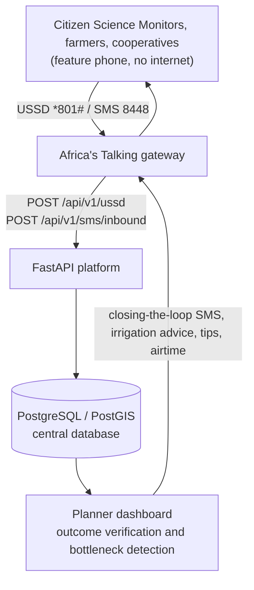

# Architecture

This document maps each element of the system design ([architecture-design.docx](architecture-design.docx)) to the part of the platform that delivers it.

## End-to-end flow (Section 4)

## Coverage

| Architecture item | Implemented as | Where |
| --- | --- | --- |
| USSD / SMS gateway | Africa's Talking-format callbacks; Kinyarwanda menu; keyword parser; dry-run until credentials are set | `services/ussd.py`, `services/sms_keywords.py`, `routes/channels.py` |
| Central database | PostgreSQL/PostGIS, Alembic migrations 01–08 | `db/models.py`, `migrations/` |
| Web dashboard with Leaflet | Planner dashboard with switchable map layers | `dashboard/planner.html`, `app.js` |
| **Module 1** Crowdsourced Yield Forecaster | USSD option 1 / `UMUSARURO`; scheme performance compares reported (or forecast) harvest with the scheme's yield target | `analytics/scheme-performance` |
| SMS Pest/Disease Alert | `NZANA` / `INDWARA` keywords, USSD option 2; pest **heatmap** layer; severity 4–5 creates an Act Now case | `analytics/pest-heatmap` |
| Household Nutrition Tracker | USSD option 6 (3 questions) gives a stunting-risk score of 1–5, by cell | `nutrition_surveys`, `analytics/nutrition-summary` |
| **Module 2** Infrastructure Health Reporter | USSD option 4; asset list from the PADAB/APEFA inventory; technical, social, institutional or environmental bottleneck | `services/ussd.py` (`ASSETS`) |
| Citizen-Led Rain Gauge Network | USSD option 3 / `IMVURA`; rainfall and drought-warning map layer | `analytics/rainfall-map` |
| Irrigation Scheduling Assistant | 7-day rainfall per sector, threshold advice, SMS broadcast to cooperatives | `advisory/irrigation-schedule[/send]` |
| **Module 3** Anonymized Grievance Log | USSD option 5 / `IKIBAZO`; reporter **not** stored, only the cell; resettlement and downstream category | `community_feedback` |
| Closing-the-Loop SMS | After resolution: preview, then SMS to every registered person in the affected cell | `feedback/{id}/notify-cell`, `cases/{id}/notify-cell` |
| Objective 2 bottleneck auto-flag | A category recurring 3 or more times in 90 days is flagged per scheme | `analytics/scheme-performance` |
| §8.1 Zero-cost and airtime incentive | 100 RWF airtime on every 3rd weather/infrastructure report (configurable); reverse-billing is an aggregator setting | `services/advisory.py` (`maybe_reward`) |
| §8.2 Cooperative Data Champions | Roles `cooperative_leader` and `citizen_science_monitor`; cooperative name on every user | `users` |
| §8.3 Local Insights broadcasts | Every harvest or rain report is answered with that sector's irrigation tip | `local_tip()` |
| §8.4 Kinyarwanda first, numeric, ≤3 levels | Every USSD screen in Kinyarwanda; numeric choices; dashboard EN/RW switch | `ussd.py`, `shared.js` |
| §5 Docker handover | Dockerfile; `infrastructure/docker-compose.yml` with PostGIS; operations guide | `infrastructure/` |
| §9.1 Yield benchmarking | `irrigation_schemes.baseline_yield_target_tons` plus its source, editable in Management | Management → Irrigation schemes |
| §9.2 Calibrated thresholds | `DRY_SPELL_THRESHOLD_MM`, `WET_SPELL_THRESHOLD_MM` settings, to calibrate from PADAB/APEFA records | `.env` |
| §9.3 Pilot sector sequencing | Reports link to a scheme through their sector; new schemes need no re-architecture | `scheme_for_cell()` |

## Deliberate differences from the sample schema (Section 7)

The running schema keeps the same six core tables and improves them. Details are in [data-model.md](data-model.md).

- Expected and reported harvest are separate, so a forecast can be compared with the result.
- Feedback has a full status workflow and audit history instead of a single `is_resolved` flag.
- Crop and infrastructure reports become **incident cases** with owners, deadlines and history.
- Stunting risk lives in its own `nutrition_surveys` table rather than on crop logs, because it is a household measure.
- PostGIS points and boundaries are used for mapping.
